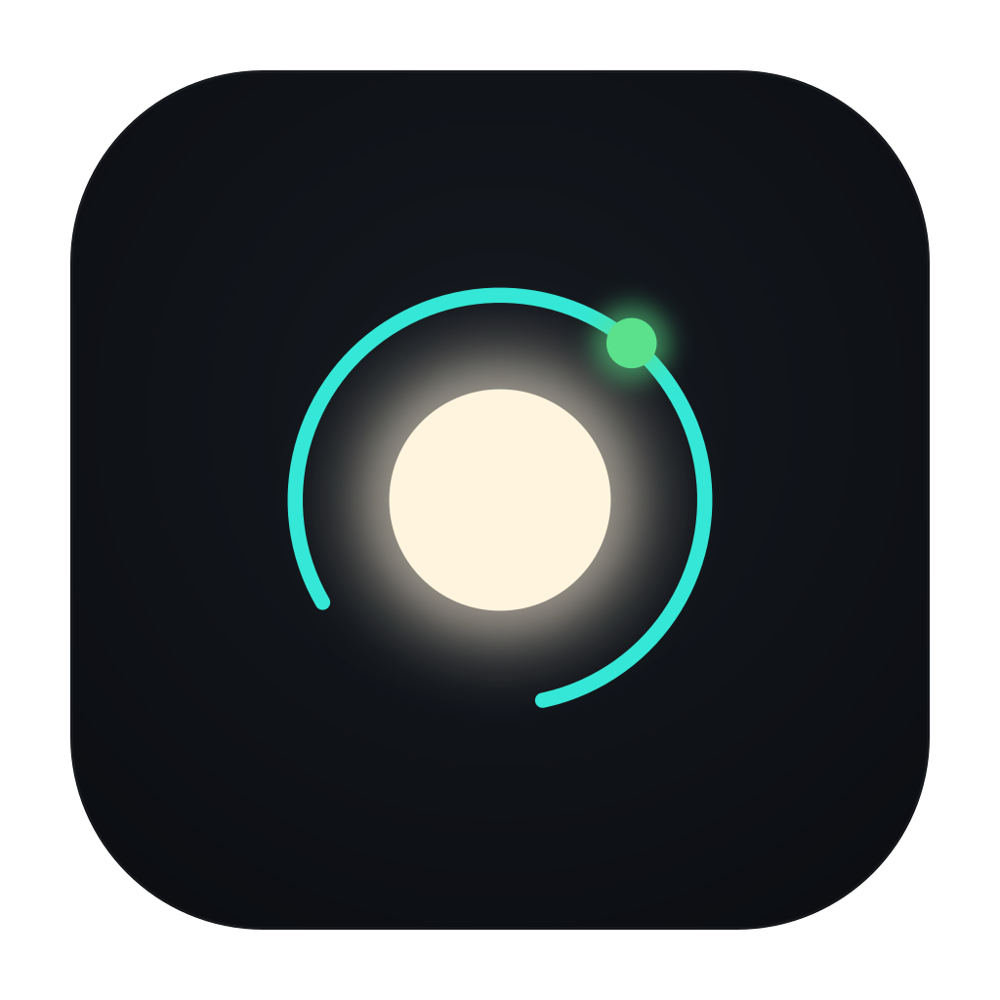
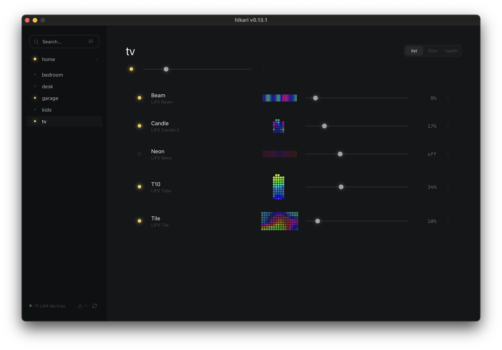
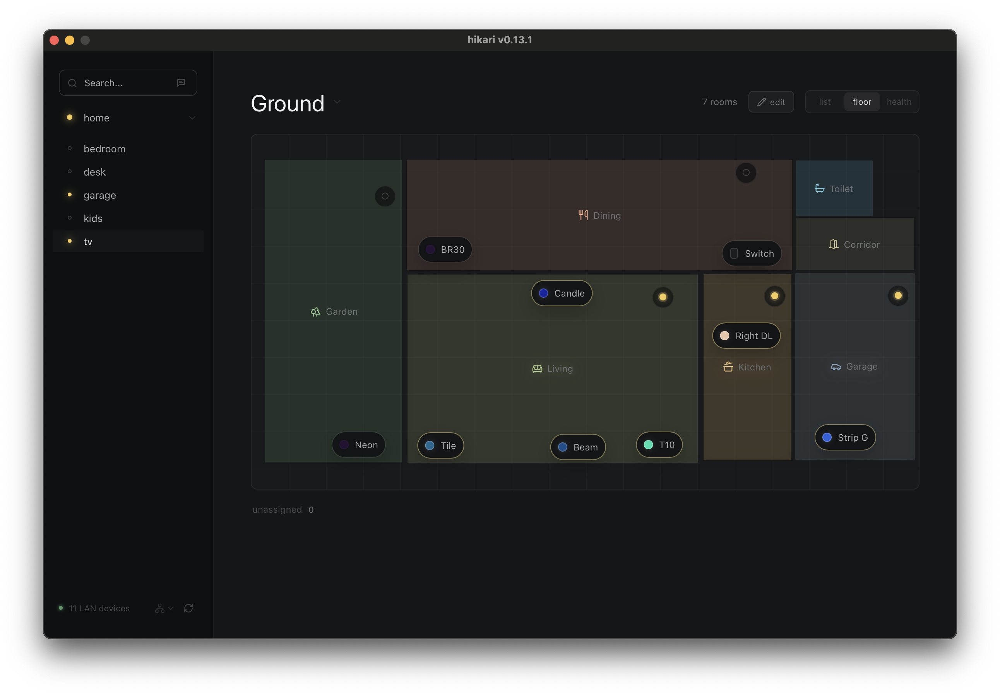
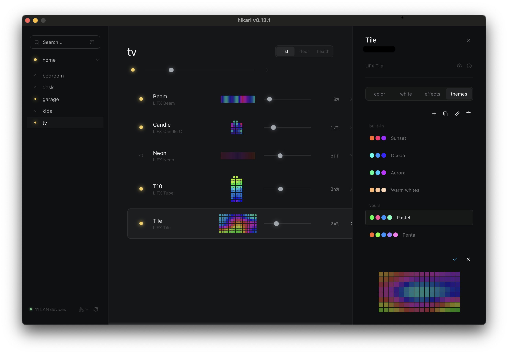
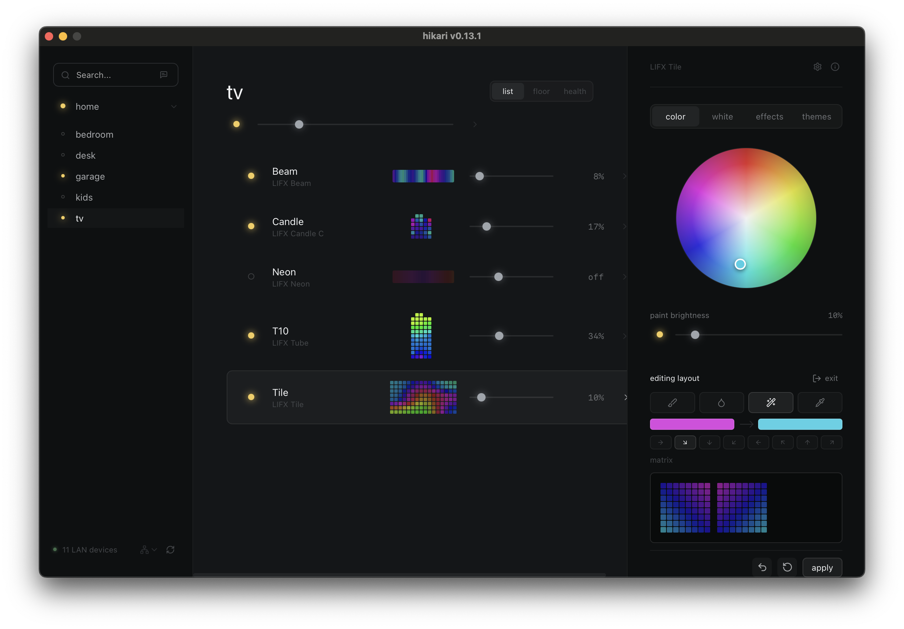
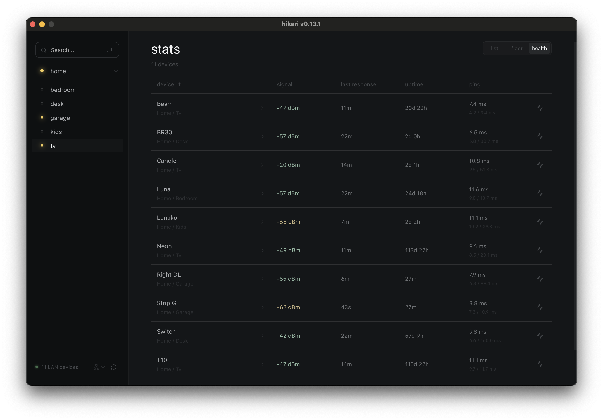
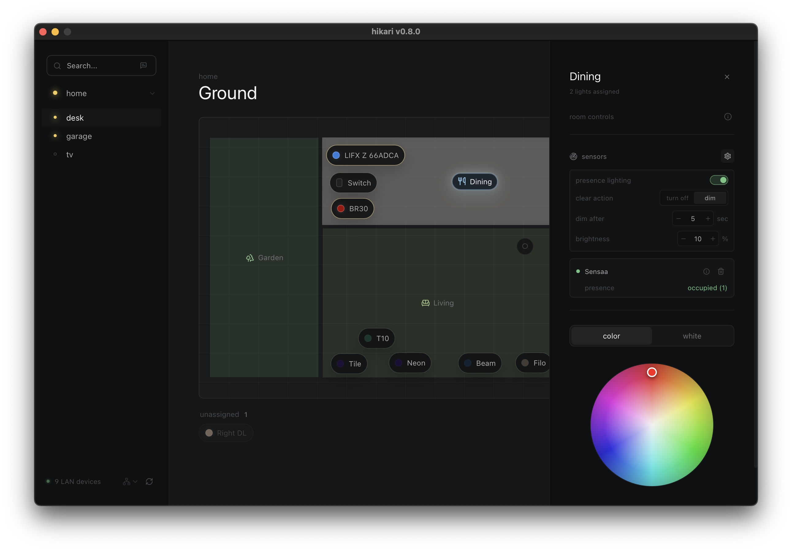
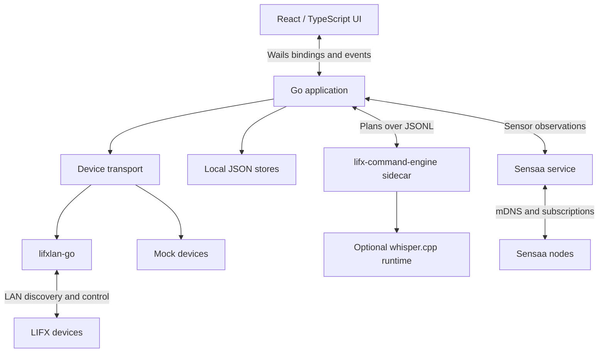

<p align="center">
  
</p>

# hikari · 光 (ひかり)

A local desktop controller for LIFX lights. Adjust individual lights, paint strips and matrices, arrange your home or workspace on a floor plan, and explore effects and color themes without a cloud account.

hikari is ready for everyday use with real LAN devices and remains in active development. It runs on macOS, Windows, and Linux, with an optional macOS voice edition.

## Download

**[Download the latest release](https://github.com/alessio-palumbo/hikari-desktop/releases/latest)**, extract the archive for your platform, and run `hikari` on the same network as your devices.

| Platform | Artifact |
| --- | --- |
| macOS | `hikari-macos.zip` |
| macOS with local voice commands | `hikari-macos-voice.zip` |
| Windows | `hikari-windows.zip` |
| Linux | `hikari-linux.tar.gz` |

The standard edition includes local text commands. The voice edition also includes whisper.cpp and the `base.en` speech model; no separate model setup is needed. macOS releases are signed and notarized. Windows builds are not signed, and Linux releases contain the Wails application rather than a distribution-specific installer.

## What You Can Do

### Control and Edit

Browse lights by location and group, search by name, and control power, brightness, color, and white temperature. Single-zone lights, multizone strips, and matrix devices share the same inspector, with controls suited to their capabilities. Supported switches have backlight, haptic, and relay controls.

For strips and matrices, enter layout editing to paint with brush, fill, picker, and gradient tools. Changes stay in a draft until you apply them, with undo and revert available. Previews account for device orientation and irregular pixel layouts.

### Map Your Space

Place lights in rooms across multiple floors, reshape rooms, and control a room's lights together. Independent floor-plan profiles let you keep home and office layouts without tying a physical space to one LIFX location.

### Explore Effects and Themes

Run on-device firmware effects or animations generated by hikari. Preview hikari animations locally before starting them, and tune their speed and appearance. Stopping a hikari animation restores its starting state; firmware effects remain device-managed.

Apply built-in color themes or create your own palettes for a light, group, or room. Themes preserve existing brightness, offer local previews, and vary color placement on repeated application.

### Check Health and Use Commands

See signal quality, last-response age, uptime, and on-demand ping results in the `health` view. Use the quick action prompt for local text commands, or speak short commands in the voice edition. Interpreted actions are validated before execution; high-confidence commands can optionally run without a confirmation step.

## Screenshots

### Group Control



### Floor Plan



### Themes



<details>
<summary>More Views</summary>

### Matrix Editor



### Device Health



### Presence Lighting



</details>

## Shortcuts

| Shortcut | Action |
| --- | --- |
| `Cmd+F` / `Ctrl+F` | Focus and select the search field. |
| `S` | Focus search when not typing in a field or using a control. |
| `Space` | Open the command prompt when not using a field or control, or when search is focused and empty. |
| `Esc` in search | Clear the text; when empty, blur the field. |
| `Esc` in the command prompt | Clear the prompt and preview; when empty, close it. |
| `Esc` with the inspector open | Close the active device or group panel. |

## Floor Plans

Use the `floor` view to arrange lights across one or more floors. Enter edit mode to add floors and rooms, rename them, choose room types, and drag unassigned devices into place.

Select a room to expose its geometry controls. Drag the room body to move it with its assigned devices, drag a vertex or side to reshape it, or use the smaller midpoint controls to add vertices. Double-click a vertex, or focus it and press `Delete` or `Backspace`, to remove it. Rooms retain at least three vertices.

Layouts are independent profiles matched using known device serials and LIFX location identifiers. hikari asks which profile to use when the match is ambiguous. Locations with the same display name are merged in the sidebar without losing their distinct identifiers, and a floor plan can include devices from every LIFX location on the same LAN.

Removing a room or floor makes its devices unassigned. Temporary network loss does not erase placement: unavailable devices remain dimmed and inactive in the layout and recover their controls when discovered again.

## Effects

The `effects` inspector tab separates device effects from hikari effects. Availability depends on the light's capabilities and, for some firmware effects, its firmware version.

Use Play/Stop to control an effect, the eye to preview a hikari animation without changing lights, and the cog to adjust settings. Settings update an open local preview; Apply starts or restarts the live effect with those settings. Reset returns the controls to hikari defaults, which take effect when applied or started.

Speed describes a full animation cycle. Appearance controls vary by effect, including trail length, thickness, direction, and background/highlight brightness. Breathe preserves the current color pattern while scaling brightness; Color Cycle moves uniformly through a palette. Local previews show a bounded clip of animation frames, not firmware effects or real-device transition timing.

Successfully started or applied settings are remembered per device and effect. Effects do not start automatically, and their palettes come from the device's current colors rather than a saved device snapshot.

## Themes

Open the `themes` inspector tab for a light, group, or floor-plan room. Clicking a theme applies it directly, preserving each light's existing brightness, including individual zone/pixel brightness. Repeated clicks cycle palette assignments for single-zone lights and strips, and vary smooth spatial color placement on matrices.

The eye below the list opens a local preview. While it is open, theme clicks update only the preview; the check icon applies the displayed variation. Closing preview returns to direct application. Applying a theme turns targeted lights on and stops their running effects. Exit matrix/multizone layout editing before applying a theme.

Use the plus to create a theme or duplicate an existing palette. User themes can be renamed, edited, and deleted; built-ins remain unchanged. The editor supports color-wheel and white-temperature selection, adding/removing colors, and changing their order. Save stores the palette without applying it; Cancel discards unsaved edits.

## Device Health

The `health` view shows signal quality, time since the last LAN response, and device uptime. Last response is an observation age, not a latency measurement.

Use a device's ping icon to measure LIFX echo round-trip latency without changing its state. Each run takes five sequential samples with a one-second timeout per sample. Results show median latency, min/max, and any timeouts; hover for the measurement time and reply count. Checks run only when requested, one at a time, and results are temporary.

## Text and Voice Commands

Open the quick action prompt from the search bar or with `Space`. Enter a command, press Enter to interpret it, review the targets and action, then press Enter again to confirm. The auto-execute option can skip confirmation for high-confidence plans that the engine does not flag for review. The same policy applies to text and voice.

In the voice edition, click the microphone to start recording and click again to stop, or hold Space while the command field is empty. Speech is transcribed locally, then follows the same interpretation and validation flow as text.

Commands use [lifx-command-engine](https://github.com/alessio-palumbo/lifx-command-engine), a separate local process that returns structured plans. hikari owns discovery, current state, target/capability validation, and execution. The standard app bundles the lightweight rule-only engine, not Python, FunctionGemma, or speech models, and does not download models automatically.

## Sensaa Sensors

An optional DIY extension: [Sensaa](https://github.com/alessio-palumbo/sensaa) nodes can provide room presence observations over the LAN. hikari discovers them over mDNS and shows their capability readings in the room inspector, including online state, presence, and detected target count when supported.

Assign presence-capable sensors to a room to enable presence lighting. A sensor belongs to one room; multiple sensors in a room use OR semantics. Presence turns the room's assigned lights on. Once all assigned sensors are online and report clear, a configurable delay leads to either turning lights off or dimming currently-on lights. Re-entry cancels the delay. After dimming, returning presence restores only brightness that hikari still owns; newer manual changes take precedence.

Offline sensors are unknown, not evidence of an empty room. Assignments use stable Sensaa node IDs and survive application restarts and sensor power cycles. IP addresses and observations are not persisted.

## Saved Data

Floor plans, sensor assignments, effect preferences, and user themes are stored in the operating system's user configuration directory:

| File | Contents |
| --- | --- |
| `floor-plan.json` | Layout profiles, device placement, and room sensor configuration. |
| `effect-settings.json` | Per-device speed and appearance settings. |
| `themes.json` | User palette definitions and stable identities. |

These files are written atomically, shared by development and installed builds, and survive replacing the application with a new release. Existing WebView-local floor plans migrate automatically. Temporary previews, effect playback/restore state, and theme application variations are not durable settings.

## Development

### Requirements

- Go 1.26
- Node.js 22 or newer and npm
- Wails v2.12.0
- On Linux, the native Wails/WebKit dependencies for your distribution

```sh
go install github.com/wailsapp/wails/v2/cmd/wails@v2.12.0
cd frontend
npm ci
cd ..
wails dev
```

For UI development without real lights:

```sh
HIKARI_TRANSPORT=mock wails dev
```

On Windows PowerShell, set `$env:HIKARI_TRANSPORT="mock"` before running `wails dev`.

### Checks and Build

```sh
cd frontend
npm run test
npm run build
cd ..
go test ./...
go vet ./...
wails build -clean
./scripts/bundle-command-sidecar.sh
```

Build the frontend before direct Go checks: `main.go` embeds `frontend/dist`. A committed `.gitkeep` allows initial Go compilation, but a production build needs actual frontend assets. `wails build` builds those assets and the desktop app; the sidecar script builds the pinned engine from `go.mod` into the app's resources on macOS or alongside the executable elsewhere.

### Local Command Engine

For development, build the sidecar with `./scripts/bundle-command-sidecar.sh` and point to it explicitly:

```sh
HIKARI_COMMAND_ENGINE_PATH="$PWD/build/bin/lifx-command-engine" wails dev
```

Alternatively, put the engine on `PATH`. Optional FunctionGemma or whisper.cpp paths can be configured in an engine config file selected with `HIKARI_COMMAND_ENGINE_CONFIG`.

### Local Voice Testing

Use a local whisper.cpp CLI and model; model download and evaluation belong to lifx-command-engine. `base.en` is the default for hikari voice releases.

```sh
./scripts/bundle-command-sidecar.sh
HIKARI_COMMAND_ENGINE_PATH="$PWD/build/bin/lifx-command-engine" \
HIKARI_WHISPER_COMMAND=/path/to/whisper-cli \
HIKARI_WHISPER_MODEL=/path/to/ggml-base.en.bin \
wails dev
```

`HIKARI_WHISPER_ARGS` forwards extra arguments to the sidecar. Use a JSON array for arguments containing spaces:

```sh
HIKARI_WHISPER_ARGS='["-ng","--prompt","turn tv off, set desk warm white, kitchen 30 percent"]'
```

hikari sends language (`en`) through the transcription request; do not pass it in `HIKARI_WHISPER_ARGS`. Recordings are temporary local WAV files.

To package existing local voice artifacts after building the app and sidecar:

```sh
HIKARI_WHISPER_COMMAND=/path/to/whisper-cli \
HIKARI_WHISPER_MODEL=/path/to/ggml-base.en.bin \
./scripts/bundle-voice-runtime.sh
```

The bundling script copies existing artifacts; it does not download runtimes or models. Normal builds and tests do not download speech models.

## Architecture



The UI owns interaction, drafts, previews, and room-level occupancy policy. Go services manage device transport, sensor subscriptions, command interpretation, and persistence. Device updates arrive through subscriptions and Wails events; recovery snapshots reconcile state without overwriting active edits.

Sensaa reports observations, and lifxlan-go handles light state and control. Room associations and lighting decisions stay in hikari; neither library depends on the other. The command engine interprets requests but never discovers or controls lights.

| Path | Responsibility |
| --- | --- |
| `main.go`, `app.go` | Wails entry point, lifecycle, and application bindings. |
| `internal/backend` | Transports, services, persistence, backend models, and tests. |
| `frontend/src/domain` | Typed models, editing/occupancy state, and reconciliation. |
| `frontend/src/components` | List, floor plan, health view, previews, and inspector. |
| `frontend/src/styles` | Shared styles and design tokens. |

### Release Builds

Tags matching `v*` trigger GitHub Actions to test and build natively on macOS, Windows, and Linux. Standard artifacts include the rule-only command sidecar. A separate macOS voice build adds whisper.cpp and `base.en`. Both macOS variants are signed and notarized; voice packaging for Windows and Linux is not available yet.
